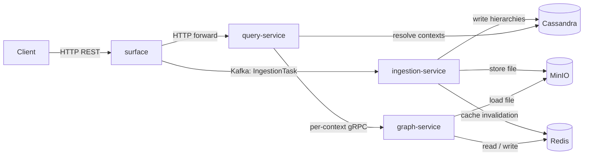
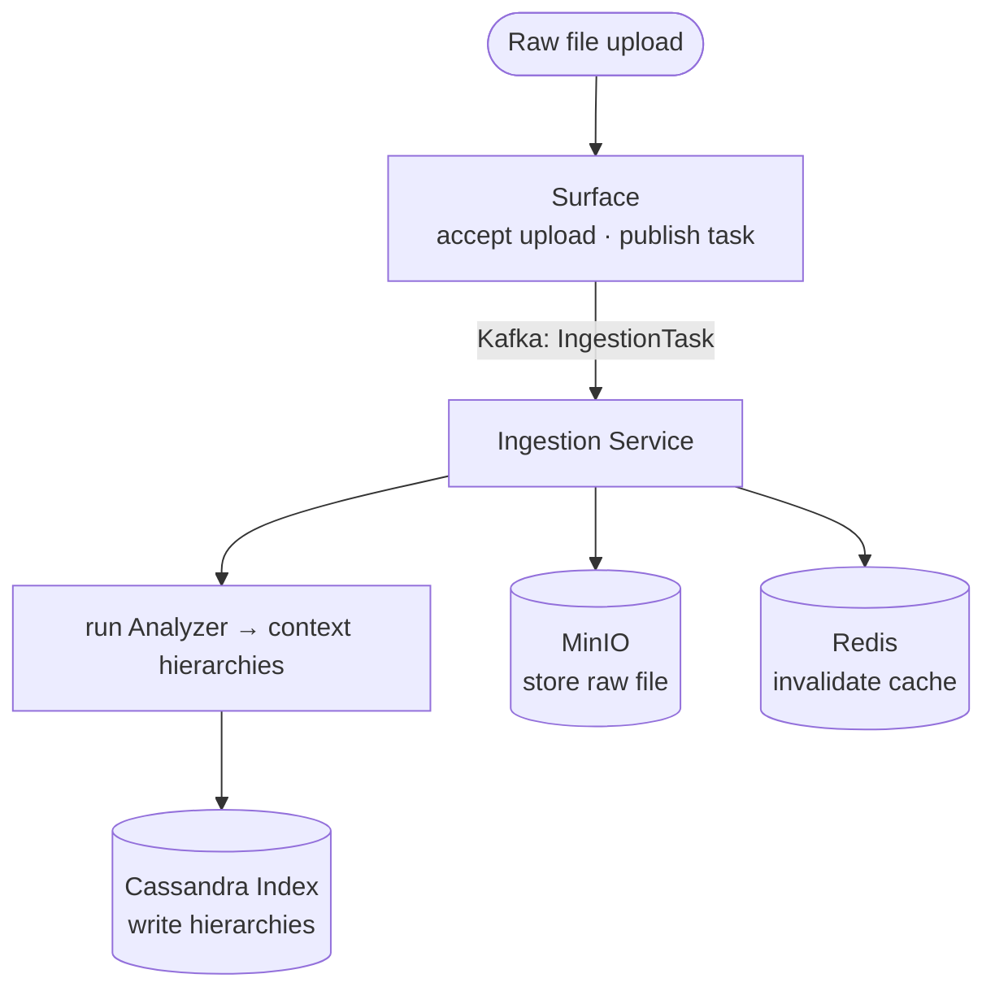
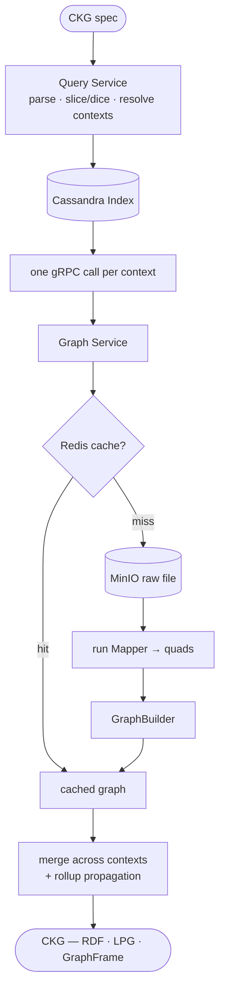

# Knowledge Graph Lakehouse

[](https://doi.org/10.5281/zenodo.21289343)

A cloud-native data lakehouse for **contextualized knowledge graphs (CKGs)**. Clients upload raw files (e.g., AIXM, IWXXM, FIXM); the system extracts multidimensional context hierarchies into an index, then reconstructs CKGs on demand by re-running mappers per context, applying merge and rollup, and returning the result as RDF, a labeled property graph (LPG), or a Spark GraphFrame.

| Property | Value |
| --- | --- |
| Language / runtime | Java 21 |
| Framework | Spring Boot 3.2 |
| Build | Maven 3.9 (multi-module) |
| Storage | Cassandra 4.x (index) · MinIO (raw files) · Redis 7 (graph cache) |
| Messaging | Kafka 3.7 (KRaft) |
| Graphs | Apache Jena (RDF) · Apache TinkerPop (LPG) · GraphFrames (Spark) |
| Service-to-service | gRPC + protobuf |
| Observability | Micrometer + OpenTelemetry → Prometheus / Tempo / Loki / Grafana |
| Deployment | Docker Compose (local) · Kubernetes (cluster) |

---

## Architecture

The system separates into a **backend** of five services and an optional **frontend** web console. The two are decoupled: the frontend reaches the backend only through the `surface` gateway's HTTP API.

### Backend

Five Spring Boot services communicate exclusively through Kafka (asynchronous messaging) or gRPC (synchronous calls); they share no direct code dependencies. The diagram below shows the four services on the core request path; the fifth, the inference service, is optional and is described in the table that follows.



| Service | Role |
| --- | --- |
| **`surface`** | REST gateway. Accepts file uploads, publishes ingestion tasks to Kafka, forwards CKG queries to `query-service`. |
| **`ingestion-service`** | Kafka consumer. Runs engine Analyzers to extract context hierarchies; writes to Cassandra; invalidates Redis. |
| **`query-service`** | Parses CKG specs, resolves contexts via Cassandra (slice/dice + rollup), issues one gRPC call per context in parallel, merges results, and (when `reasoning=on`) calls `inference-service`. |
| **`graph-service`** | gRPC server. Loads raw files from MinIO, runs engine Mappers, builds and caches **base/asserted** graphs in Redis. Performs no reasoning, so it stays on the latency-critical request path. |
| **`inference-service`** | gRPC server (optional). Stateless: given a context's base graph + schema/engine, runs the rule engine (`libs/reasoning`, Jena) and returns derived triples; caches them per `(context, ruleset)`. |

### Frontend

A **web console** (Next.js) offers a browser interface over the `surface` gateway. It queries the knowledge graph and visualizes the result as a graph, table, OLAP cube, or raw data; browses schemas; ingests source files; reviews query history; and monitors service health. It is a standalone service that calls only `surface` and passes through its authentication.

Because the frontend uses only the public `surface` API, it is optional and replaceable. You can run the bundled console as-is, extend it, or build your own interface — a custom dashboard, a notebook integration, or a domain-specific viewer — against the same API.

---

## Ingestion flow



Ingestion stores the raw file once and records in the index only the multidimensional context hierarchies (time, location, topic) extracted from it. The construction flow below uses those hierarchies to reconstruct graphs on demand.

---

## CKG construction flow



Key design choices:

- **Domain-agnostic**: dimensions, levels, and rollup functions come from YAML schemas (`config/schemas/atm.yaml`); no domain-specific code outside `engines/`.
- **Single generic Cassandra schema**: one `hierarchies` table keyed by dimension with `MAP<TEXT,TEXT>` — not one table per dimension.
- **Graph representation is a per-query parameter**, not a global mode.
- **Engines are plugins** discovered via `ServiceLoader`. A new format (CSV, JSON-LD) requires only a new module under `engines/`.
- **Observability by contract**: trace IDs propagate across HTTP / gRPC / Kafka headers; metric names are pinned in the HLD (High Level Design).

---

## Asserted and derived knowledge

Like the reference implementation of KG-OLAP (Schuetz et al., *Knowledge Graph OLAP*, Semantic Web
12(4), 2021), each context cell carries two kinds of knowledge, expressed as named graphs (RDF
"modules"):

- **Asserted** — the base facts the engine `Mapper` transcribes from the raw file, in the context's
  `…-mod` module (`ckr:hasAssertedModule`).
- **Derived** — the materialized RDFS/OWL closure of those facts, in the context's `…-inf` module
  (`ckr:hasModule` + `ckr:closureOf`, with `ckr:derivedFrom` provenance). For example a feature
  typed `aixm:VOR` is inferred to also be a `aixm:NavaidEquipment` and a `aixm:Navaid`.

**Separation of concerns.** Ingestion and base-graph construction stay on the latency-critical path and
never reason. Derived knowledge is produced by a dedicated, optional **`inference-service`**: pass
`reasoning=on` (query param, default off) and `query-service` sends each context's base graph to it,
then stamps the returned triples into the `…-inf` module (plus `olap:covers` coverage on rollup).
The inference-service is stateless (base graph in → derived out) and caches derived triples per
`(context, ruleset)`; the rule backend is pluggable (`InferenceEngine`, Jena RDFS/OWL today —
unlike the KG-OLAP reference implementation, which used RDFpro).

The schema-level axioms (the terminological box, or TBox) are assembled from two sources merged into one reasoner model:

1. `subClassOf` axioms **auto-generated** from the `topic` dimension hierarchy in the schema YAML
   (`category → family → feature`), and
2. an optional per-engine supplementary ontology (`engines/aixm-engine/.../ontology/aixm.ttl`,
   initially empty).

Add `rdfs:domain`/`rdfs:range`/`owl:propertyChainAxiom` to the supplementary ontology to enrich
derived knowledge with no code change — `TBoxRegistry` upgrades the reasoner profile automatically.
The asserted/derived split is faithful for the RDF representation; LPG/GraphFrame outputs carry
asserted content only (no native named-graph concept).

---

## Documentation

| Document | Contents |
| --- | --- |
| [docs/high-level-design.md](docs/high-level-design.md) | Goals, system context, component responsibilities, metric catalog, sequence diagrams. Start here. |
| [docs/deployment-docker.md](docs/deployment-docker.md) | Run the full stack locally with Docker Compose. |
| [docs/deployment-kubernetes.md](docs/deployment-kubernetes.md) | Deploy to a Kubernetes cluster with the example manifests. |
| [docs/building-from-source.md](docs/building-from-source.md) | Build the JARs, the web console, and (optionally) your own container images. |

---

## Deployment

Both deployment paths use the published release images (`basharahmad/lakehouse-*:1.0.4`); no local build is required.

- **Local (Docker Compose)** — the full stack on one machine. See [docs/deployment-docker.md](docs/deployment-docker.md).
- **Kubernetes** — the example manifests under [`deploy/kubernetes`](deploy/kubernetes). See [docs/deployment-kubernetes.md](docs/deployment-kubernetes.md).

The quickest way to try the system locally:

```sh
cd deploy/docker
docker compose up -d --wait
curl -fsS http://localhost:8080/actuator/health
```

Once the stack is running, the web console is at <http://localhost:3001> and Grafana at <http://localhost:3000>.

---

## Repository layout

```shell
.
├── libs/                     # Shared library modules
│   ├── domain-model/         # CKG domain types: CubeSchema, Hierarchy, Context, Member, …
│   ├── engine-api/           # Engine plugin contracts: Engine, Analyzer, Mapper, GraphBuilder
│   ├── grpc-api/             # gRPC service definitions (protobuf)
│   ├── index-client/         # Cassandra index repository
│   ├── storage-client/       # MinIO + local-filesystem storage
│   ├── messaging-client/     # Kafka producer/consumer abstraction
│   ├── cache-client/         # Redis-backed graph cache
│   ├── observability/        # Micrometer + OpenTelemetry wiring
│   ├── graph-builders/       # GraphBuilder impls: RDF (Jena, asserted/derived modules), LPG (TinkerPop)
│   ├── graph-builders-spark/ # GraphFrame builder, JSON Lines path
│   └── reasoning/            # RDFS/OWL closure (Jena) + schema-derived TBox, asserted→derived
├── engines/                  # Engine plugins (ServiceLoader-discovered)
│   ├── aixm-engine/          # AIXM Analyzer + Mapper
│   ├── fixm-engine/          # FIXM Analyzer + Mapper
│   └── iwxxm-engine/         # IWXXM Analyzer + Mapper
├── services/                 # Deployable Spring Boot services
│   ├── surface/              # REST gateway (port 8080)
│   ├── ingestion-service/    # Kafka-driven ingestion pipeline
│   ├── query-service/        # KG query orchestrator (port 8081)
│   ├── graph-service/        # gRPC base-graph reconstructor + cache (port 9090)
│   └── inference-service/    # gRPC rule-based derivation, optional (port 9091)
├── web/                      # Next.js web console (frontend)
├── config/schemas/           # Cube schemas (atm.yaml, fixm.yaml, meteo.yaml)
├── rulesets/                 # Reasoning rules and ontologies (TBox) per engine
├── deploy/
│   ├── docker/               # docker-compose.yaml + supporting config (local deployment)
│   └── kubernetes/           # Example manifests, with an optional observability stack
├── docs/                     # Architecture and deployment documentation
└── pom.xml                   # Root Maven POM
```

The E1–E5 evaluation suite — reproduction scripts, analysis notebooks, and the measured result evidence — is maintained in a separate repository: [kg-lakehouse-evaluation](https://github.com/dke-kgolap/kg-lakehouse-evaluation) (archived at [doi:10.5281/zenodo.21395266](https://doi.org/10.5281/zenodo.21395266)).

---

## Building and testing

| Command | Purpose |
| --- | --- |
| `mvn package` | Compile + assemble all JARs + run unit tests |
| `mvn verify` | `package` + spotless format check |
| `mvn package -DskipTests` | Fast build, skip tests |
| `mvn test -pl libs/domain-model` | Run one module's unit tests |
| `mvn spotless:apply` | Auto-fix formatting violations |
| `npm ci && npm run build` (in `web/`) | Build the web console |

Full build instructions — including how to build your own container images — are in [docs/building-from-source.md](docs/building-from-source.md).

Conventions:

- Spring Boot `@Configuration` classes whose beans are replaced in tests carry `@Profile("!test")`.
- All inter-service messaging goes through `MessagingService` in `libs/messaging-client`. No `@KafkaListener` in service code.
- Test doubles live under `src/test/java/.../fakes/` and are shared via `*-test-support` modules.

---

## Extending the system

**New engine** (e.g. CSV, JSON-LD): create `engines/<name>-engine/` with `<Name>Engine`, `<Name>Analyzer`, `<Name>Mapper`. Register via `META-INF/services/at.jku.dke.bigkgolap.api.engines.Engine`. See `engines/iwxxm-engine/` as a reference.

**New graph representation**: implement `GraphBuilder` and register a `GraphProvider` via ServiceLoader. See `libs/graph-builders-spark/` as a reference.

**New rollup function**: register via `RollUpFun.register("name", fn)`. Built-ins: `builtin:date_to_month`, `builtin:date_to_year`, `lookup`.

**New dimension or level**: edit the YAML schema (`config/schemas/atm.yaml`); no code change required.

**New frontend**: build any client against the `surface` gateway's HTTP API — schema management, file ingestion, and CKG queries are all exposed there. The bundled web console (`web/`) is a reference implementation; a replacement frontend needs no backend change.

---

## License and citation

If you use this work, please cite the archived artifact:

> Ahmad, B., Schuetz, C. G., and Bozzato, L. *Knowledge Graph Lakehouse: a cloud-native data
> lakehouse for contextualized knowledge graphs.* Version 1.0.4, Zenodo, 2026.
> [doi:10.5281/zenodo.21289343](https://doi.org/10.5281/zenodo.21289343)

A [`CITATION.cff`](CITATION.cff) file is included for citation managers. The accompanying journal
article is under review; its citation will be added here upon publication.

This repository is released under the BSD 3-Clause License; see the [LICENSE](LICENSE) file for the full text.
