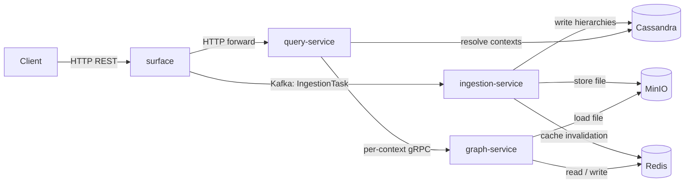

# Big KGOLAP - Lakehouse

A cloud-native data lakehouse for **contextualised knowledge graphs (CKGs)**. Clients upload raw files (AIXM, IWXXM, FIXM); the system extracts multidimensional context hierarchies into an index, then reconstructs CKGs on demand by re-running mappers per context, applying merge and rollup, and returning the result as RDF, a labelled property graph (LPG), or a Spark GraphFrame.

| Property | Value |
| --- | --- |
| Language / runtime | Java 21 |
| Framework | Spring Boot 3.2 |
| Build | Maven 3.9 (multi-module) |
| Storage | Cassandra 4.x (index) · MinIO (raw files) · Redis 7 (graph cache) |
| Messaging | Kafka 3.7 (KRaft) |
| Graphs | Apache Jena (RDF) · Apache TinkerPop (LPG) · GraphFrames (Spark) |
| Service-to-service | gRPC + protobuf |
| Observability | Micrometer + OpenTelemetry → Prometheus / Tempo / Loki / Grafana |
| Deployment | Docker Compose (dev) · K3s + Kustomize (cluster) |

---

## Architecture

Five Spring Boot services communicate exclusively through Kafka (asynchronous messaging) or gRPC (synchronous calls); they share no direct code dependencies. The diagram below shows the four services on the core request path; the fifth, the inference service, is optional and is described in the table that follows.



| Service | Role |
| --- | --- |
| **`surface`** | REST gateway. Accepts file uploads, publishes ingestion tasks to Kafka, forwards CKG queries to `query-service`. |
| **`ingestion-service`** | Kafka consumer. Runs engine Analyzers to extract context hierarchies; writes to Cassandra; invalidates Redis. |
| **`query-service`** | Parses CKG specs, resolves contexts via Cassandra (slice/dice + rollup), issues one gRPC call per context in parallel, merges results, and (when `reasoning=on`) calls `inference-service`. |
| **`graph-service`** | gRPC server. Loads raw files from MinIO, runs engine Mappers, builds and caches **base/asserted** graphs in Redis. Performs no reasoning, so it stays on the latency-critical request path. |
| **`inference-service`** | gRPC server (optional). Stateless: given a context's base graph + schema/engine, runs the rule engine (`libs/reasoning`, Jena) and returns derived triples; caches them per `(context, ruleset)`. |

---

## Query flow


Key design choices:

- **Domain-agnostic**: dimensions, levels, and rollup functions come from YAML schemas (`config/schemas/atm.yaml`); no domain-specific code outside `engines/`.
- **Single generic Cassandra schema**: one `hierarchies` table keyed by dimension with `MAP<TEXT,TEXT>` — not one table per dimension.
- **Graph representation is a per-query parameter**, not a global mode.
- **Engines are plugins** discovered via `ServiceLoader`. A new format (CSV, JSON-LD) requires only a new module under `engines/`.
- **Observability by contract**: trace IDs propagate across HTTP / gRPC / Kafka headers; metric names are pinned in the HLD (High Level Design).

---

## Asserted and derived knowledge

Like the reference KG-OLAP implementation, each context cell carries two kinds of knowledge,
expressed as named graphs (RDF "modules"):

- **Asserted** — the base facts the engine `Mapper` transcribes from the raw file, in the context's
  `…-mod` module (`ckr:hasAssertedModule`).
- **Derived** — the materialized RDFS/OWL closure of those facts, in the context's `…-inf` module
  (`ckr:hasModule` + `ckr:closureOf`, with `ckr:derivedFrom` provenance). For example a feature
  typed `aixm:VOR` is inferred to also be a `aixm:NavaidEquipment` and a `aixm:Navaid`.

**Separation of concerns.** Ingestion and base-graph construction stay on the latency-critical path and
never reason. Derived knowledge is produced by a dedicated, optional **`inference-service`**: pass
`reasoning=on` (query param, default off) and `query-service` sends each context's base graph to it,
then stamps the returned triples into the `…-inf` module (plus `olap:covers` coverage on rollup).
The inference-service is stateless (base graph in → derived out) and caches derived triples per
`(context, ruleset)`; the rule backend is pluggable (`InferenceEngine`, Jena RDFS/OWL today — **not**
RDFpro, which the original used).

The schema-level axioms (the terminological box, or TBox) are assembled from two sources merged into one reasoner model:

1. `subClassOf` axioms **auto-generated** from the `topic` dimension hierarchy in the schema YAML
   (`category → family → feature`), and
2. an optional per-engine supplementary ontology (`engines/aixm-engine/.../ontology/aixm.ttl`,
   initially empty).

Add `rdfs:domain`/`rdfs:range`/`owl:propertyChainAxiom` to the supplementary ontology to enrich
derived knowledge with no code change — `TBoxRegistry` upgrades the reasoner profile automatically.
The asserted/derived split is faithful for the RDF representation; LPG/GraphFrame outputs carry
asserted content only (no native named-graph concept).

---

## Documentation

| Document | Contents |
|---|---|
| [docs/high-level-design.md](docs/high-level-design.md) | Goals, system context, component responsibilities, metric catalogue, sequence diagrams. Start here. |
| [docs/low-level-design.md](docs/low-level-design.md) | Module-by-module spec: domain model, Cassandra schema, gRPC proto, query language, YAML formats, observability wiring, K8s manifests. |
| [docs/reports/k3s-deployment-guide.md](docs/reports/k3s-deployment-guide.md) | Operator runbook: install K3s → build images → apply manifests → verify → tear down. |
| [papers/SIDs_2025__AWARE_.pdf](papers/SIDs_2025__AWARE_.pdf) | Original paper: domain context (AIM/AWARE/SESAR), motivating use cases, conceptual model. |
| [papers/swj2504.pdf](papers/swj2504.pdf) | Companion paper (Semantic Web Journal): deeper treatment of CKGs and KG-OLAP. |

---

## User manual

### Prerequisites

| Requirement | Version |
|---|---|
| Java (JDK) | 21+ |
| Maven | 3.9+ |
| Docker + Docker Compose | v2 |
| `curl` | any |
| `grpcurl` (for graph demos) | any |

### 1. Start the infrastructure

```sh
docker compose up -d --wait
```

This starts Cassandra, Kafka, Redis, MinIO, Prometheus, Grafana, Tempo, Loki, and Promtail. The `--wait` flag blocks until all health checks pass (~90 s on first run).

### 2. Build the services

```sh
mvn package -DskipTests
```

A self-contained executable JAR file is written to each service's `target/` directory.

### 3. Start the services

Open a terminal per service:

```sh
# Terminal 1 — REST gateway (port 8080)
LAKEHOUSE_STORAGE_KIND=minio \
  java -jar services/surface/target/surface-1.0.0.jar

# Terminal 2 — ingestion pipeline
LAKEHOUSE_STORAGE_KIND=minio \
  java -jar services/ingestion-service/target/ingestion-service-1.0.0.jar

# Terminal 3 — query orchestrator (port 8081)
java -jar services/query-service/target/query-service-1.0.0.jar

# Terminal 4 — gRPC graph service (port 9090)
java -jar services/graph-service/target/graph-service-1.0.0.jar

# Terminal 5 — gRPC inference service (port 9091); only needed for reasoning=on queries
java -jar services/inference-service/target/inference-service-1.0.0.jar
```

`LAKEHOUSE_STORAGE_KIND=minio` routes file I/O through the MinIO container. Omit it to use the local filesystem (no MinIO required, but the two storage backends won't share files).

### 4. Register a schema

A schema defines the dimensions, levels, and rollup functions for a domain. The ATM schema is bundled:

```sh
curl -s -X POST http://localhost:8080/api/schemas \
     -H "Content-Type: application/yaml" \
     --data-binary @config/schemas/atm.yaml
```

Verify:

```sh
curl -s http://localhost:8080/api/schemas/atm | jq .
```

### 5. Ingest a file

Upload a multi-feature AIXM file and associate it with the `atm` schema:

```sh
curl -s -X POST "http://localhost:8080/api/schemas/atm/files" \
     -F "file=@engines/aixm-engine-test-support/src/main/resources/fixtures/aixm-multi-feature.xml" \
     -F "contentType=application/xml+aixm"
```

The ingestion service will extract context hierarchies asynchronously. Poll the stats endpoint to confirm:

```sh
curl -s http://localhost:8080/api/schemas/atm/stats | jq .
# expect: totalContexts >= 1
```

### 6. Query a knowledge graph

Issue a KG query using the SQL-style syntax:

```sh
curl -s -X POST http://localhost:8081/api/schemas/atm/query \
     -H "Content-Type: application/json" \
     -d '{
           "query": "SELECT * FROM atm",
           "representation": "RDF"
         }' | jq .
```

Supported `representation` values: `RDF`, `LPG`, `GRAPHFRAME`.

### 7. Run acceptance demos

Each script exercises one end-to-end feature path and asserts a result:

```sh
scripts/demo-ingestion.sh        # schema registration + AIXM ingestion
scripts/demo-query.sh            # slice/dice + rollup query
scripts/demo-graph.sh            # gRPC graph streaming
scripts/demo-multigraph.sh       # RDF / LPG / GraphFrame from the same query
scripts/demo-meteorology.sh      # IWXXM engine + meteo schema
scripts/demo-observability.sh    # trace propagation + Prometheus metrics
scripts/demo-benchmark.sh        # p50/p95/p99 latency report
scripts/demo-experiment.sh       # YAML-driven parameter-sweep experiment
```

### 8. Tear down

```sh
docker compose down -v
```

The `-v` flag removes all named volumes (Cassandra data, MinIO objects, etc.).

---

## Quick start (K3s cluster)

Full deployment runbook: **[docs/reports/k3s-deployment-guide.md](docs/reports/k3s-deployment-guide.md)**.

Short version (Linux + native K3s):

```sh
curl -sfL https://get.k3s.io | sh -                    # install K3s
TAG=dev scripts/build-images.sh                        # build the five service images
TAG=dev scripts/k3s-import.sh                          # import into K3s' containerd
kubectl apply -k deploy/k8s/overlays/dev               # apply manifests (~45 resources)
scripts/demo-k3s.sh                                    # end-to-end self-check
```

To run a parameter-sweep experiment that scales replicas via the K8s API:

```sh
kubectl apply -k deploy/k8s/overlays/experiment
mvn package -pl tools/experiment-runner -am -DskipTests -q
java -jar tools/experiment-runner/target/experiment-runner-1.0.0.jar \
    run experiments/sample-cache-warmth.yaml --output-dir /tmp/exp/
```

---

## Repository layout

```
.
├── libs/                     # Shared library modules
│   ├── domain-model/         # CKG domain types: CubeSchema, Hierarchy, Context, Member, …
│   ├── engine-api/           # Engine plugin contracts: Engine, Analyzer, Mapper, GraphBuilder
│   ├── grpc-api/             # gRPC service definitions (protobuf)
│   ├── index-client/         # Cassandra index repository
│   ├── storage-client/       # MinIO + local-filesystem storage
│   ├── messaging-client/     # Kafka producer/consumer abstraction
│   ├── cache-client/         # Redis-backed graph cache
│   ├── observability/        # Micrometer + OpenTelemetry wiring
│   ├── graph-builders/       # GraphBuilder impls: RDF (Jena, asserted/derived modules), LPG (TinkerPop)
│   ├── graph-builders-spark/ # GraphFrame builder, JSON Lines path
│   └── reasoning/            # RDFS/OWL closure (Jena) + schema-derived TBox, asserted→derived
├── engines/                  # Engine plugins (ServiceLoader-discovered)
│   ├── aixm-engine/          # AIXM Analyzer + Mapper
│   ├── fixm-engine/          # FIXM Analyzer + Mapper
│   └── iwxxm-engine/         # IWXXM Analyzer + Mapper
├── services/                 # Deployable Spring Boot services
│   ├── surface/              # REST gateway (port 8080)
│   ├── ingestion-service/    # Kafka-driven ingestion pipeline
│   ├── query-service/        # KG query orchestrator (port 8081)
│   ├── graph-service/        # gRPC base-graph reconstructor + cache (port 9090)
│   └── inference-service/    # gRPC rule-based derivation, optional (port 9091)
├── tools/                    # CLI tooling
│   ├── benchmark/            # Latency benchmark CLI
│   └── experiment-runner/    # YAML-driven parameter-sweep CLI
├── deploy/
│   ├── monitoring/           # Prometheus, Grafana, Tempo, Loki, Promtail configs
│   └── k8s/                  # Kustomize base + dev / experiment / perf / scale overlays
├── config/schemas/           # Cube schemas (atm.yaml, fixm.yaml, meteo.yaml)
├── bench/                    # Benchmark workload definitions
├── experiments/              # Sample experiment YAMLs
├── evaluation/               # Self-contained E1–E5 experiment suite (own cluster/, deploy/, harness/, datasets/); published as a standalone repository
├── web/                      # Next.js operator console
├── scripts/                  # Demo + build scripts
├── papers/                   # Reference papers
├── docs/                     # Design and operations documentation
└── pom.xml                   # Root Maven POM
```

---

## Building and testing

| Command | Purpose |
|---|---|
| `mvn package` | Compile + assemble all JARs + run unit tests |
| `mvn verify` | `package` + spotless format check |
| `mvn package -DskipTests` | Fast build, skip tests |
| `mvn test -pl libs/domain-model` | Run one module's unit tests |
| `mvn spotless:apply` | Auto-fix formatting violations |
| `mvn package -pl tools/benchmark -am -DskipTests` | Build the benchmark CLI JAR |
| `mvn package -pl tools/experiment-runner -am -DskipTests` | Build the experiment-runner CLI JAR |

Conventions:
- Spring Boot `@Configuration` classes whose beans are replaced in tests carry `@Profile("!test")`.
- All inter-service messaging goes through `MessagingService` in `libs/messaging-client`. No `@KafkaListener` in service code.
- Test doubles live under `src/test/java/.../fakes/` and are shared via `*-test-support` modules.

---

## Extending the system

**New engine** (e.g. CSV, JSON-LD): create `engines/<name>-engine/` with `<Name>Engine`, `<Name>Analyzer`, `<Name>Mapper`. Register via `META-INF/services/at.jku.dke.bigkgolap.api.engines.Engine`. See `engines/iwxxm-engine/` as a reference.

**New graph representation**: implement `GraphBuilder` and register a `GraphProvider` via ServiceLoader. See `libs/graph-builders-spark/` as a reference.

**New rollup function**: register via `RollUpFun.register("name", fn)`. Built-ins: `builtin:date_to_month`, `builtin:date_to_year`, `lookup`.

**New dimension or level**: edit the YAML schema (`config/schemas/atm.yaml`); no code change required.

---

## License and citation

If you use this work, please cite the SIDs 2025 paper:

> Ahmad, B. & Schuetz, C. (2025). *A Cloud-Native Lakehouse Architecture for Using Knowledge Graphs in Aeronautical Information Management*. SIDs 2025.

The repository is distributed without a license file; treat it as research code shared in good faith.
