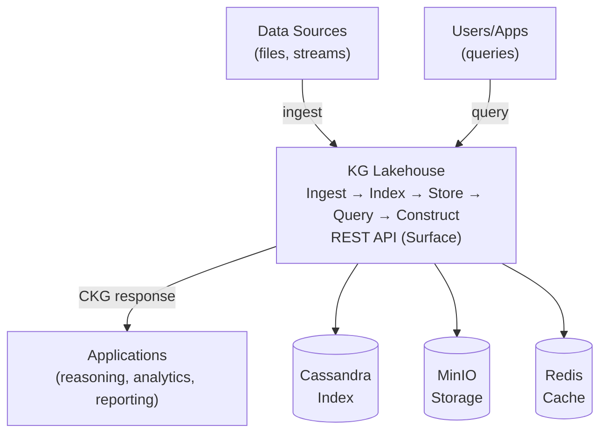
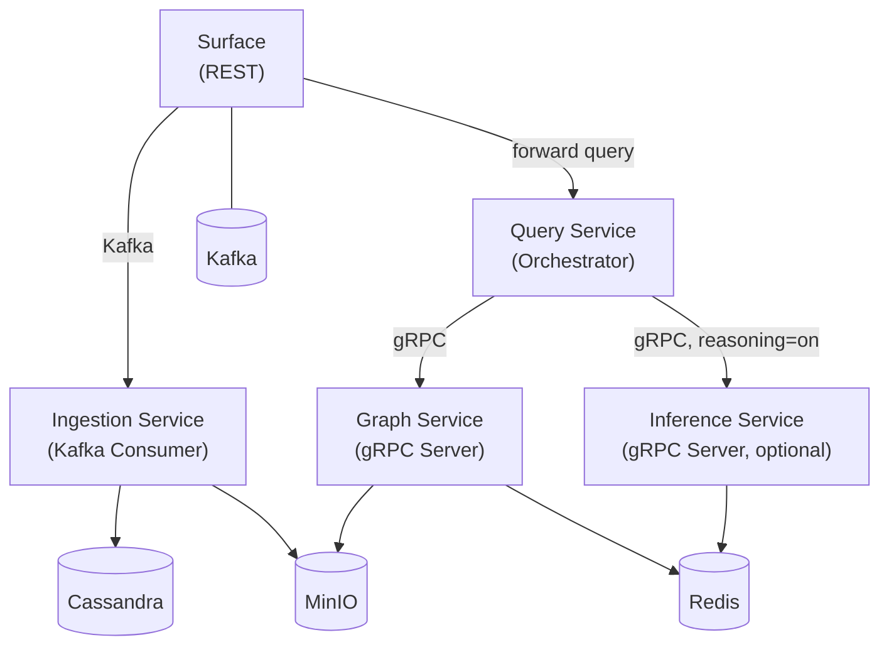
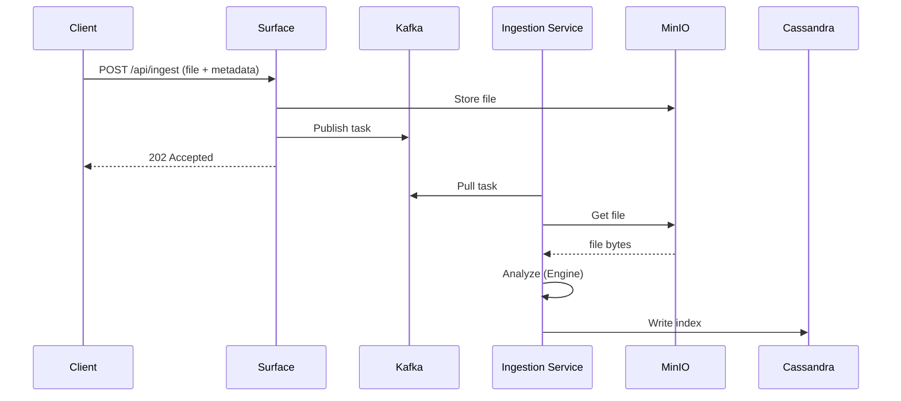
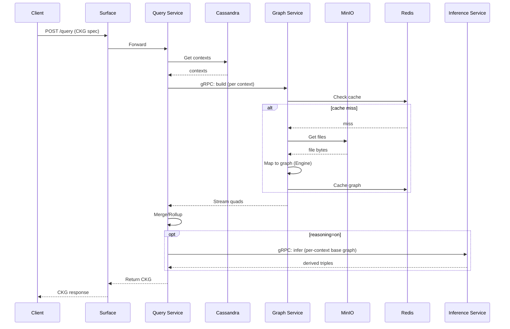
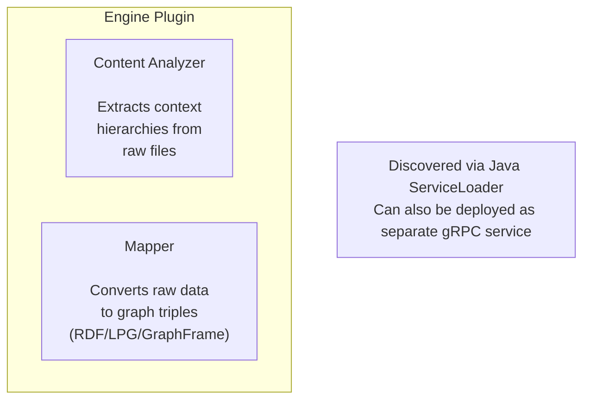
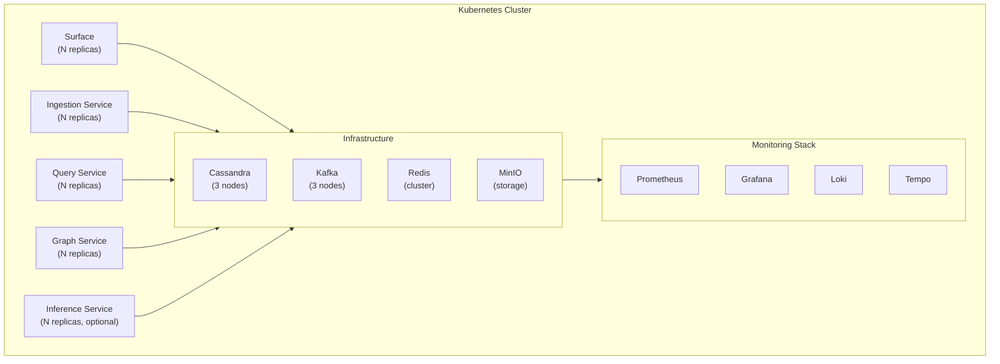
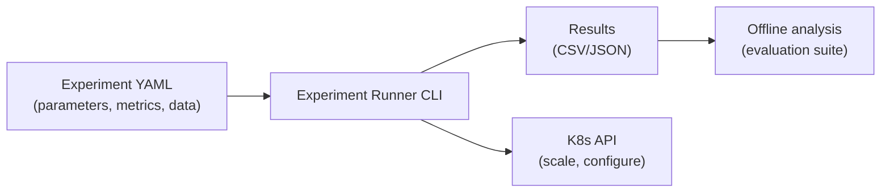

# Knowledge Graph Lakehouse - High-Level Design Document

**Project:** kg-lakehouse
**Authors:** Bashar Ahmad
**Affiliation:** Institute of Business Informatics - Data & Knowledge Engineering, Johannes Kepler University Linz
**Version:** 2.1
**Date:** 2026-07-02
**Status:** Draft

---

## 1. Introduction

### 1.1 Purpose

This document describes the high-level architecture of the Knowledge Graph Lakehouse, a cloud-native data lakehouse for managing contextualized knowledge graphs (CKGs). The system ingests heterogeneous data streams, performs semantic and contextual indexing, and constructs task-specific CKGs on demand as KG-OLAP cubes.

### 1.2 Background

The Knowledge Graph Lakehouse was first described in the SIDs 2025 paper *"A Cloud-Native Lakehouse Architecture for Using Knowledge Graphs in Aeronautical Information Management"* (Ahmad & Schuetz, 2025). The initial proof-of-concept was implemented in Java 11 / Spring Boot 2.5.6 and validated with an air traffic management (ATM) use case.

This document describes version 2.0 — a ground-up reimplementation that makes the system **domain-agnostic**, supports **multiple graph representations**, provides **research-grade observability**, enables **automated experimentation**, and adds **optional rule-based inference**.

### 1.3 Scope

This document covers:

- System goals and non-goals.
- Architectural overview and service decomposition.
- Data flow for ingestion and CKG construction.
- Infrastructure and deployment topology.
- Cross-cutting concerns (observability, security, configuration).

### 1.4 Terminology

| Term | Definition |
| ------ | ----------- |
| **KG** | Knowledge Graph — a graph-structured representation of real-world entities, properties, and relationships |
| **CKG** | Contextualized Knowledge Graph — a KG partitioned into contexts (e.g., by time, location, topic) |
| **KG-OLAP Cube** | A multidimensional structure organizing KGs into contexts along hierarchical dimensions, supporting OLAP operations (slice, dice, merge) |
| **Context** | A unique intersection of dimension hierarchies (e.g., time=2025-01-15, location=LOWW, topic=AirportHeliport) |
| **Hierarchy** | An ordered path through a dimension's levels (e.g., day→month→year) |
| **Content Analyzer** | A domain-specific plugin that extracts contextual metadata from raw files |
| **Engine** | A pluggable module providing both a Content Analyzer and a Mapper for a specific data format |
| **RDF** | Resource Description Framework — W3C standard for graph data |
| **LPG** | Labeled Property Graph — graph model used by Neo4j, TinkerPop |

---

## 2. Goals and Non-Goals

### 2.1 Goals

1. **Domain-agnostic**: Context dimensions, hierarchies, and rollup functions are fully configurable. No domain-specific code in core services. Different use cases (ATM, healthcare, IoT, etc.) are supported through configuration and engine plugins.

2. **Multi-graph representation**: Constructed CKGs can be output as RDF (Apache Jena), LPG (Apache TinkerPop), or GraphFrames (Apache Spark), selected per query.

3. **Scalable ingestion**: Ingest high-velocity, high-variety data streams with horizontal scaling of ingestion components.

4. **On-demand KG construction**: Construct task-specific CKGs from indexed raw data, avoiding the scalability limits of monolithic KGs.

5. **Research-grade observability**: Structured metrics, distributed tracing, and logging at every pipeline stage. Every operation is measurable for performance experiments.

6. **Automated experimentation**: YAML-driven experiment definitions with automated infrastructure scaling, benchmark execution, and metric collection.

7. **Cloud-native**: Kubernetes-first deployment with separation of storage and compute, horizontal scaling, and fault tolerance.

### 2.2 Non-Goals

- **Real-time stream processing**: The system processes files/messages, not continuous event streams. Stream processing (e.g., via Kafka Streams) may be added as a separate service later.
- **Full query and analytics engines**: The lakehouse constructs CKGs and offers optional, opt-in rule-based inference (via the Inference Service, see Section 3.3). SPARQL querying, graph analytics, and reporting remain the responsibility of downstream applications.
- **A comprehensive user-facing UI**: The backend remains UI-agnostic, exposing all functionality through the `surface` REST API. A reference web console ships with the system (see Section 3.5), but a full-featured or domain-specific interface is left to downstream applications.
- **Multi-tenancy**: Single-tenant deployment. Multi-schema support is for experimentation, not tenant isolation.

---

## 3. Architectural Overview

### 3.1 System Context



### 3.2 Lakehouse Principles

The architecture reflects core data lakehouse principles:

- **Separation of storage and compute**: Raw files stored in MinIO (object storage), independent of processing services. Services can scale without affecting storage.
- **Schema-on-read**: Raw files are stored as-is. Schema is applied during CKG construction, not at ingestion time.
- **Metadata-driven indexing**: Context hierarchies in Cassandra enable efficient file retrieval without scanning raw data. The index is the "metadata layer" of the lakehouse.

### 3.3 Service Decomposition

Five microservices, each independently deployable and scalable (the Inference Service is optional):



| Service | Responsibility | Scaling Strategy |
|---------|---------------|-----------------|
| **Surface** | REST API gateway. Accepts file uploads, creates ingestion tasks (publishes to Kafka), forwards queries to Query Service. | Scale horizontally for ingestion throughput |
| **Ingestion Service** | Kafka consumer. Pulls ingestion tasks, retrieves files from MinIO, runs Content Analyzers, writes context indexes to Cassandra. | Scale horizontally (Kafka partitions) |
| **Query Service** | Parses CKG specifications, resolves matching contexts from Cassandra index, orchestrates Graph Service for CKG construction, performs merge/rollup, and (when reasoning is requested) calls the Inference Service. | Scale horizontally for query throughput |
| **Graph Service** | gRPC server. Loads raw files from MinIO, runs Mappers to produce graph triples, manages Redis graph cache. Streams constructed graphs back to caller. | Scale horizontally for graph construction throughput |
| **Inference Service** | gRPC server (optional). Given a context's base graph, runs the rule engine and returns derived triples; caches them per (context, ruleset). Invoked only when a query requests reasoning. | Scale horizontally for reasoning throughput |

### 3.4 Shared Modules

Non-deployable libraries shared across services:

| Module | Purpose |
|--------|---------|
| **domain-model** | Core types: CubeSchema, Hierarchy, Member, Level, Context, MergeLevels, RollUpFun |
| **engine-api** | Plugin interfaces: Engine, Analyzer, Mapper |
| **grpc-api** | Protobuf definitions and generated stubs |
| **index-client** | Cassandra client for context index operations |
| **storage-client** | MinIO/S3 and local filesystem abstraction |
| **messaging-client** | Kafka producer/consumer abstraction |
| **cache-client** | Redis graph cache |
| **graph-builders** | GraphBuilder implementations: RDF (Jena, asserted/derived modules) and LPG (TinkerPop) |
| **graph-builders-spark** | GraphFrame builder (Spark) |
| **reasoning** | RDFS/OWL closure (Jena) and schema-derived TBox for the Inference Service |
| **observability** | Micrometer metrics + OpenTelemetry tracing configuration |

### 3.5 Frontend (Web Console)

A reference web console (Next.js) provides a browser interface to the system. It is a separate, optional service — it is not part of the backend's messaging mesh, and it reaches the backend solely through the `surface` gateway's HTTP API.

**Responsibilities.** The console lets an operator submit CKG queries and inspect the result as a graph, table, OLAP cube, or raw data; browse registered schemas; upload source files for ingestion; review query history; and monitor service health.

**Boundary and security.** The browser never calls `surface` directly. Each screen accesses the backend through the console's own same-origin routes, which proxy server-side to `surface`. The gateway credentials are held only on the server side and injected by the proxy, so they never reach the browser; the console keeps no credentials of its own and passes through `surface`'s HTTP Basic authentication.

**Design stance.** Because the console depends only on the public `surface` API, the frontend is optional and replaceable. It serves as a reference implementation; an alternative interface — a custom dashboard, a notebook integration, or a domain-specific viewer — can be built against the same API with no change to the backend. This keeps the backend UI-agnostic, as stated in Section 2.2.

---

## 4. Data Flow

### 4.1 Data Ingestion



**Steps:**
1. Client uploads a file with metadata (engine type, content type) to the Surface REST API
2. Surface stores the raw file in MinIO and publishes an ingestion task to Kafka
3. Surface returns `202 Accepted` immediately (asynchronous processing)
4. Ingestion Service consumes the task from Kafka
5. Ingestion Service retrieves the raw file from MinIO
6. The appropriate Content Analyzer (determined by engine type) extracts multidimensional context hierarchies
7. Context indexes are inserted or updated in Cassandra (hierarchies, contexts, file-context links)

### 4.2 CKG Construction



**Steps:**

1. Client submits a CKG specification (dimensions, levels, values, rollup instructions) to the Surface
2. Surface forwards to Query Service
3. Query Service parses the specification into slice/dice context + merge levels
4. Query Service resolves matching contexts from the Cassandra index
5. For each context, Query Service calls Graph Service via gRPC (in parallel)
6. Graph Service checks Redis cache; on miss, loads files from MinIO and runs Mappers
7. Graph Service streams constructed graph (as quads/triples) back to Query Service
8. Query Service performs merge/rollup operations and assembles the final CKG
9. If reasoning is requested (`reasoning=on`), Query Service sends each context's base graph to the Inference Service and stamps the returned derived triples into the CKG
10. CKG is returned to the client

---

## 5. Domain-Agnostic Design

### 5.1 Configurable Dimensions

The system makes **zero assumptions** about what dimensions exist. Dimensions, their levels, and their hierarchies are defined entirely in YAML configuration:

```yaml
# Example: ATM use case
dimensions:
  time:
    levels: [year, month, day]
  location:
    levels: [territory, fir, location]
  topic:
    levels: [category, family, feature]
```

```yaml
# Example: IoT use case
dimensions:
  time:
    levels: [year, quarter, month, day, hour]
  device_group:
    levels: [region, building, floor, device]
  measurement_type:
    levels: [domain, category, metric]
```

No code changes required — only configuration.

### 5.2 Pluggable Engines

Domain-specific logic is encapsulated in engine plugins:



Engines are discovered at runtime via Java `ServiceLoader`. Each engine provides:
- A unique identifier (e.g., `"AIXM"`, `"CSV"`, `"JSON-LD"`)
- A Content Analyzer that extracts `Set<Hierarchy>` from input files
- A Mapper that converts file content to graph triples

### 5.3 Pluggable Rollup Functions

Rollup functions (how a child level aggregates to a parent level) are configurable per level:

- **Built-in temporal functions**: `builtin:date_to_month`, `builtin:date_to_year` — generic ISO date string truncation
- **Lookup-based rollup**: Uses the hierarchy data table to determine parent values (e.g., airport LOWW → FIR LOVV → territory Austria)
- **Custom functions**: Extensible via class name reference for domain-specific rollups

---

## 6. Multi-Graph Representation

The system supports constructing CKGs in three graph formats:

| Format | Library | Use Case |
|--------|---------|----------|
| **RDF** | Apache Jena | Semantic web, SPARQL, linked data, reasoning |
| **LPG** | Apache TinkerPop | Property graph analytics, Gremlin traversals |
| **GraphFrame** | Apache Spark | Large-scale distributed graph analytics |

The `GraphBuilder` interface abstracts graph construction. The Mapper writes to a `GraphBuilder`, and the specific implementation determines the output format. The desired format is specified per query request.

---

## 7. Infrastructure

### 7.1 Technology Stack

| Component | Technology | Purpose |
|-----------|-----------|---------|
| **Language** | Java 21 | All services and shared modules |
| **Framework** | Spring Boot 3.x | Service lifecycle, dependency injection, configuration, web |
| **Index Store** | Apache Cassandra | Context index with generic dimension tables |
| **Object Storage** | MinIO (S3-compatible) | Raw file storage |
| **Graph Cache** | Redis | Pre-computed graph caching with time-to-live (TTL) expiry |
| **Message Queue** | Apache Kafka | Asynchronous ingestion pipeline, event streaming |
| **Inter-Service** | gRPC (Protobuf) | Graph Service streaming communication |
| **Build** | Maven 3.9 | Multi-module build |
| **Containers** | Docker | Service packaging |
| **Orchestration** | Kubernetes | Deployment, scaling, service discovery |

### 7.2 Deployment Topology



**Local development**: `docker-compose.yaml` provides the full infrastructure stack locally.

**Experiments**: K3s (lightweight Kubernetes) for development; full K8s cluster for performance experiments with configurable node counts and replica scaling.

---

## 8. Observability

### 8.1 Three Pillars

| Pillar | Technology | Purpose |
|--------|-----------|---------|
| **Metrics** | Micrometer → Prometheus → Grafana | Throughput, latency, cache hit rates, queue depth |
| **Tracing** | OpenTelemetry → Tempo | End-to-end request traces across services |
| **Logging** | SLF4J + Logback → Loki | Structured logs with trace correlation |

### 8.2 Key Metrics

**Ingestion pipeline:**
- `lakehouse.ingestion.files.total` — counter of ingested files
- `lakehouse.ingestion.analysis.duration` — per-file content analysis time
- `lakehouse.ingestion.index.write.duration` — per-file index write time
- `lakehouse.ingestion.file.size.bytes` — file size histogram
- `lakehouse.ingestion.queue.depth` — Kafka consumer lag

**Query pipeline:**
- `lakehouse.query.total` — counter by query type
- `lakehouse.query.context.resolution.duration` — Cassandra lookup time
- `lakehouse.query.graph.construction.duration` — per-context graph build time
- `lakehouse.query.merge.duration` — merge/rollup time
- `lakehouse.query.total.duration` — end-to-end query time
- `lakehouse.query.cache.hit` — Redis cache hit/miss ratio
- `lakehouse.query.contexts.count` — contexts per query histogram
- `lakehouse.query.quads.count` — output quads per query histogram

**Reasoning (optional, when `reasoning=on`):**
- `lakehouse.inference.duration` — per-context rule-engine derivation time

### 8.3 Distributed Tracing

Every request produces a trace with spans for each processing phase. Trace context is propagated:
- Between Surface and Query Service via HTTP headers
- Between Query Service and Graph Service (and, when reasoning is requested, the Inference Service) via gRPC metadata
- Between Surface and Ingestion Service via Kafka headers

---

## 9. Experiment Management

### 9.1 Overview

The system includes a dedicated experiment runner for automated benchmarking:



### 9.2 Experiment Configuration

Experiments are defined as YAML files specifying:

- Parameters to vary (file counts, replica counts, batch sizes)
- Data source and engine type
- Metrics to collect
- Warmup and measurement rounds

### 9.3 Workflow

1. Experiment Runner reads YAML configuration
2. For each parameter combination:
   - Scales K8s deployments via Kubernetes API
   - Loads test data via Surface REST API
   - Executes query workloads via Surface REST API
   - Scrapes Prometheus for metrics during the measurement window
3. Exports results as CSV/JSON for offline analysis (see the evaluation suite)

---

## 10. Security

### 10.1 Authentication

- REST API protected with HTTP Basic Authentication (configurable credentials)
- Inter-service communication (gRPC, Kafka) within the K8s cluster is unauthenticated (network-level isolation via K8s network policies)

### 10.2 Data Protection

- Raw files stored in MinIO with bucket-level access control
- Cassandra authentication enabled in production
- No personally identifiable information (PII) in the default ATM use case; domain-specific data handling is the responsibility of the engine plugins